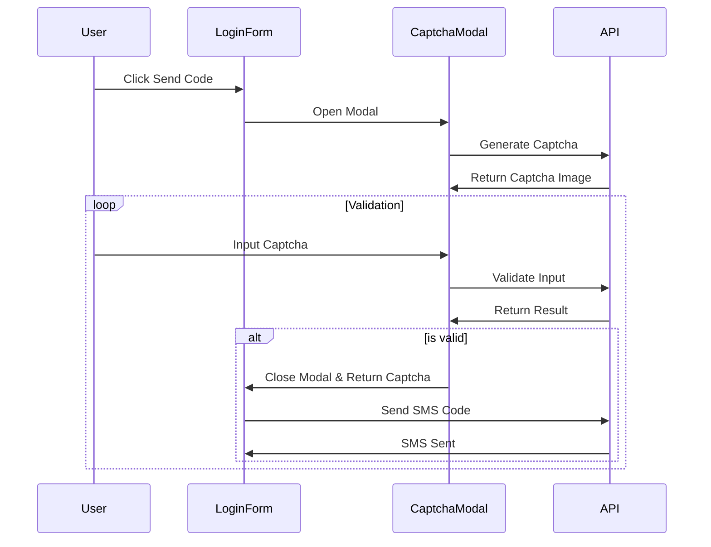

# 验证码弹窗改进计划

## 问题背景
当前验证码验证失败的原因是由于大小写敏感性导致的。同时，验证码的展示方式需要优化为弹窗形式。

## 改进方案

### 后端改动

1. 修改验证码查询为大小写不敏感
```java
// CaptchaRecordRepository.java
@Query("SELECT c FROM CaptchaRecord c WHERE c.captchaId = ?1 AND LOWER(c.captchaCode) = LOWER(?2) AND c.status = 0 AND c.expiredAt > ?3")
Optional<CaptchaRecord> findValidCaptcha(String captchaId, String captchaCode, LocalDateTime now);
```

### 前端改动

1. 新建 CaptchaModal 组件
```javascript
// src/components/auth/CaptchaModal.js
- 弹窗布局和样式
- 图形验证码显示
- 输入框和实时验证
- 验证成功自动关闭
```

2. 修改 CaptchaInput 组件
- 移除 toLowerCase 转换
- 优化验证逻辑

3. 更新 LoginForm 组件
- 集成 CaptchaModal
- 改进验证码发送流程

## 交互流程



## 实现步骤

1. 后端修改
   - 更新 CaptchaRecordRepository 中的查询语句
   - 测试修改后的查询是否正确处理大小写

2. 前端实现
   - 创建 CaptchaModal 组件
   - 修改 CaptchaInput 组件
   - 更新 LoginForm 组件
   - 添加必要的样式
   - 实现实时验证逻辑

3. 测试验证
   - 测试大小写输入场景
   - 测试验证码过期场景
   - 测试自动关闭功能
   - 测试短信发送流程

## 预期结果

1. 验证码验证不再区分大小写
2. 验证码展示在弹窗中，提升用户体验
3. 实时验证提供即时反馈
4. 验证成功自动关闭弹窗并发送短信验证码