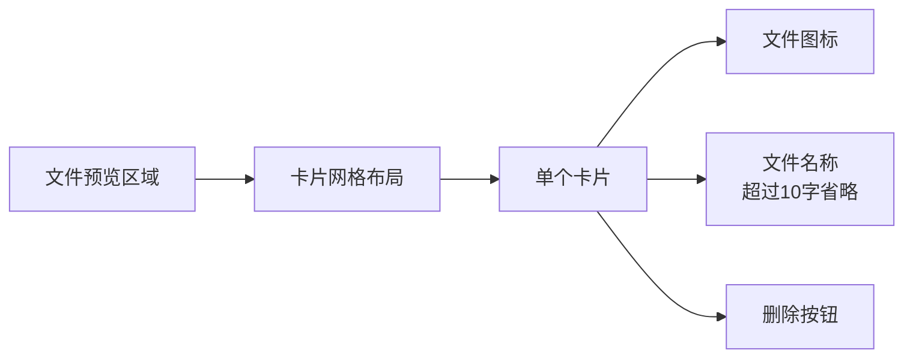
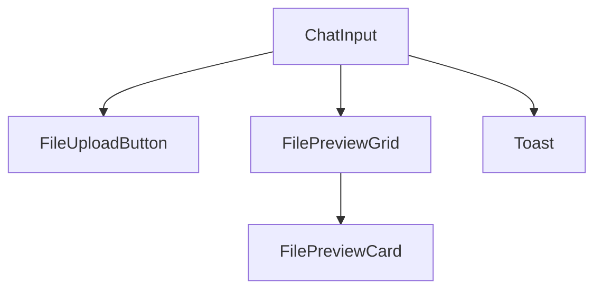

# ChatInput组件改进计划（更新版）

## 1. 文件处理约束

### 文件限制
```javascript
const FILE_CONSTRAINTS = {
  maxCount: 10,         // 所有类型通用的最大文件数
  IMAGE: {
    maxSize: 30 * 1024 * 1024,   // 30MB
    tooltip: '最多10个，最大30MB'
  },
  VIDEO: {
    maxSize: 100 * 1024 * 1024,  // 100MB
    tooltip: '最多10个，最大100MB'
  },
  AUDIO: {
    maxSize: 100 * 1024 * 1024,  // 100MB
    tooltip: '最多10个，最大100MB'
  },
  FILE: {
    maxSize: 100 * 1024 * 1024,  // 100MB
    tooltip: '最多10个，最大100MB'
  }
}
```

## 2. UI设计

### 2.1 文件预览卡片


样式特点：
- 卡片使用grid布局，自动换行
- 固定卡片宽度，超出显示省略号
- 删除按钮位于右上角
- 卡片间距均匀
- 支持响应式布局

### 2.2 上传按钮提示
- 使用Tooltip组件
- 悬浮时显示对应类型的限制信息
- 工具提示位置在按钮上方

### 2.3 错误提示改进
- 使用Toast组件
- 2秒后自动消失
- 不阻塞用户操作
- 位置固定在页面右上角

## 3. 组件结构

### 3.1 新增组件


### 3.2 卡片组件结构
```javascript
const FilePreviewCard = ({ file, onRemove }) => (
  <div className="relative p-3 border rounded-lg">
    <div className="absolute top-2 right-2">
      <button onClick={onRemove}>
        <i className="fas fa-times" />
      </button>
    </div>
    <div className="flex items-center">
      <i className="fas fa-file mr-2" />
      <span className="truncate max-w-[150px]">{file.name}</span>
    </div>
  </div>
);
```

### 3.3 网格布局样式
```css
.file-preview-grid {
  display: grid;
  grid-template-columns: repeat(auto-fill, minmax(200px, 1fr));
  gap: 1rem;
  padding: 1rem 0;
}
```

## 4. 交互逻辑

### 4.1 文件选择验证
```javascript
const validateFileSelection = (files, type) => {
  const constraints = FILE_CONSTRAINTS[type];
  const totalFiles = currentFiles.length + files.length;

  if (totalFiles > FILE_CONSTRAINTS.maxCount) {
    showToast(`最多只能上传${FILE_CONSTRAINTS.maxCount}个文件`);
    return false;
  }

  for (const file of files) {
    if (file.size > constraints.maxSize) {
      showToast(`文件大小超出限制：${file.name}`);
      return false;
    }
  }

  return true;
};
```

### 4.2 Toast提示实现
```javascript
const ToastManager = {
  show: (message) => {
    // 创建toast元素
    const toast = document.createElement('div');
    toast.className = 'fixed top-4 right-4 bg-gray-800 text-white px-4 py-2 rounded-lg z-50 animate-fade-in';
    toast.textContent = message;
    
    document.body.appendChild(toast);
    
    // 2秒后移除
    setTimeout(() => {
      toast.classList.add('animate-fade-out');
      setTimeout(() => document.body.removeChild(toast), 300);
    }, 2000);
  }
};
```

## 5. 实现步骤

1. 更新fileUtils.js，添加新的文件限制配置
2. 创建新的Toast组件和管理器
3. 创建FilePreviewGrid和FilePreviewCard组件
4. 更新FileUploadButton组件，添加Tooltip
5. 修改ChatInput组件，整合新的组件和逻辑
6. 添加新的动画和过渡效果
7. 调整整体布局和响应式设计

## 6. 关键CSS类

```css
/* 文件预览卡片 */
.file-preview-card {
  @apply relative p-3 border rounded-lg bg-white shadow-sm hover:shadow-md transition-shadow;
}

/* 文件名省略 */
.file-name {
  @apply truncate max-w-[150px] text-sm;
}

/* Toast动画 */
@keyframes fadeInOut {
  0% { opacity: 0; transform: translateY(-20px); }
  10% { opacity: 1; transform: translateY(0); }
  90% { opacity: 1; transform: translateY(0); }
  100% { opacity: 0; transform: translateY(-20px); }
}

.toast {
  animation: fadeInOut 2s ease-in-out;
}

/* 工具提示 */
.tooltip {
  @apply invisible absolute -top-full left-1/2 transform -translate-x-1/2 px-2 py-1 text-xs text-white bg-gray-800 rounded whitespace-nowrap opacity-0 transition-opacity group-hover:visible group-hover:opacity-100;
}
```

## 7. 测试用例

1. 文件上传限制：
   - 尝试上传超过限制数量的文件
   - 尝试上传超过大小限制的文件
   - 验证不同类型文件的限制是否正确

2. UI交互：
   - 验证卡片布局在不同屏幕尺寸下的表现
   - 确认文件名超长时的省略显示
   - 测试删除按钮的点击响应

3. 提示信息：
   - 验证Tooltip显示的正确性和时机
   - 测试Toast提示的显示和自动消失
   - 确认错误提示不会阻塞用户操作