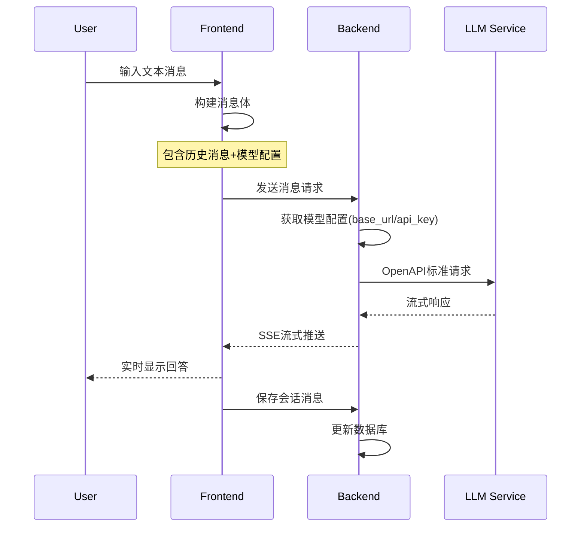
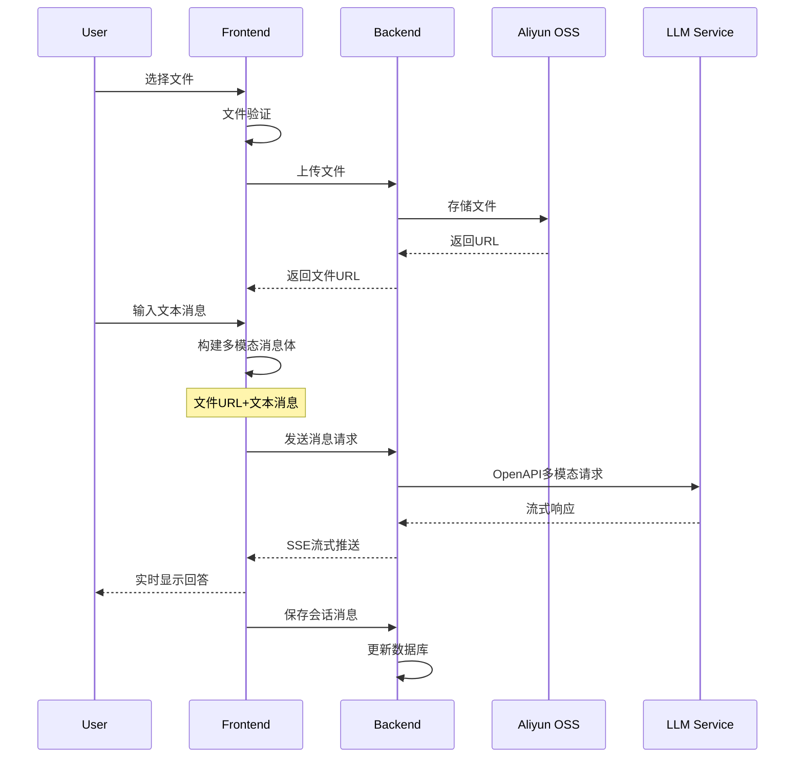
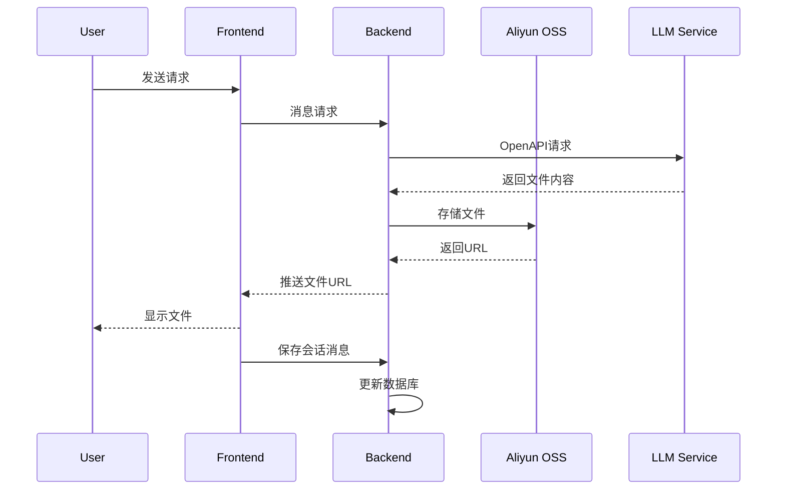

# 大模型对话功能实现方案

## 一、功能概述

分三个阶段实现大模型对话功能:
1. 纯文本对话
2. 文件上传对话
3. 模型输出文件处理

## 二、技术方案

### 2.1 纯文本对话流程

### 2.2 文件上传对话流程

### 2.3 模型输出文件处理流程

## 三、具体实现步骤

### 3.1 第一阶段：纯文本对话实现

1. 前端改造
   - 在Chat.js中实现handleSendMessage方法
   - 添加调用模型API的service方法
   - 实现SSE消息监听
   - 实现打字机效果展示

2. 后端改造
   - 实现消息处理Controller
   - 实现模型调用Service
   - 实现SSE消息推送
   - 完善错误处理

### 3.2 第二阶段：文件上传对话实现

1. 前端改造
   - 完善FileUploadButton组件
   - 实现文件预览
   - 优化消息发送逻辑
   - 适配多模态消息展示

2. 后端改造  
   - 实现OSS文件上传
   - 适配多模态消息处理
   - 完善错误处理

### 3.3 第三阶段：模型输出文件处理

1. 前端改造
   - 实现文件类型消息展示
   - 优化消息流处理

2. 后端改造
   - 实现文件存储服务
   - 实现文件URL生成
   - 完善错误处理

## 四、注意事项

1. 安全性考虑
   - 文件上传验证
   - 接口权限控制
   - 敏感信息过滤

2. 性能优化
   - 大文件分片上传
   - 消息流优化
   - 缓存机制

3. 用户体验
   - 加载状态提示
   - 错误信息展示
   - 断线重连机制

4. 开发建议
   - 严格遵循RESTful API规范
   - 做好日志记录
   - 添加必要的单元测试