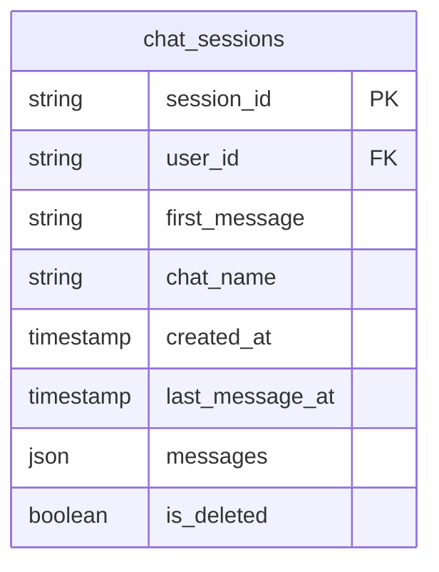
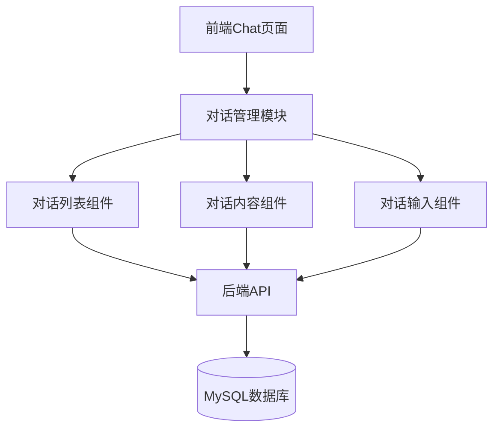
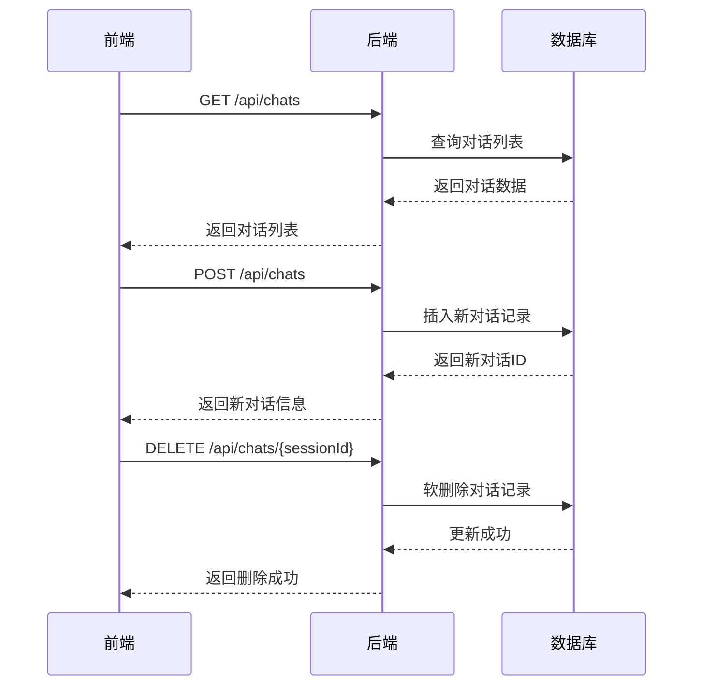

# 对话管理功能实现计划

## 1. 数据库设计



## 2. 系统架构



## 3. API设计



## 4. 详细实现计划

### 前端实现
1. 修改 ChatSidebar 组件
```javascript
- 添加对话列表展示
- 实现新建对话按钮
- 添加对话项的删除功能
- 支持对话选中状态
```

2. 修改 Chat.js 主组件
```javascript
- 添加对话管理相关状态
- 实现对话切换逻辑
- 实现新建对话逻辑
- 实现删除对话逻辑
```

3. 样式实现
```css
- 对话列表项样式
- 选中状态样式
- 删除按钮及确认弹窗样式
```

### 后端实现
1. 数据库表创建
```sql
CREATE TABLE chat_sessions (
    session_id VARCHAR(50) PRIMARY KEY,
    user_id VARCHAR(50) NOT NULL,
    first_message TEXT,
    chat_name VARCHAR(255),
    created_at TIMESTAMP DEFAULT CURRENT_TIMESTAMP,
    last_message_at TIMESTAMP DEFAULT CURRENT_TIMESTAMP,
    messages JSON,
    is_deleted BOOLEAN DEFAULT FALSE,
    INDEX idx_user_id (user_id),
    INDEX idx_created_at (created_at)
);
```

2. 后端API实现
- ChatController：处理对话相关的HTTP请求
- ChatService：实现对话管理的业务逻辑
- ChatRepository：实现数据库操作

## 5. 实施步骤

1. 数据库准备
   - 创建chat_sessions表
   - 添加必要的索引

2. 后端开发
   - 实现基础的CRUD操作
   - 实现对话内容的存储和检索
   - 添加必要的数据验证和错误处理

3. 前端开发
   - 实现对话列表UI组件
   - 实现新建对话功能
   - 实现删除对话功能
   - 实现对话切换功能

4. 测试和优化
   - 单元测试
   - 集成测试
   - UI/UX优化
   - 性能优化

## 6. 注意事项

1. 安全性考虑
   - 确保用户只能访问自己的对话
   - 防止SQL注入和XSS攻击
   - 数据库备份策略

2. 性能考虑
   - 对话内容的分页加载
   - 大量对话时的性能优化
   - 数据库索引优化

3. 用户体验
   - 对话切换时的加载状态
   - 删除操作的确认机制
   - 错误提示的友好展示