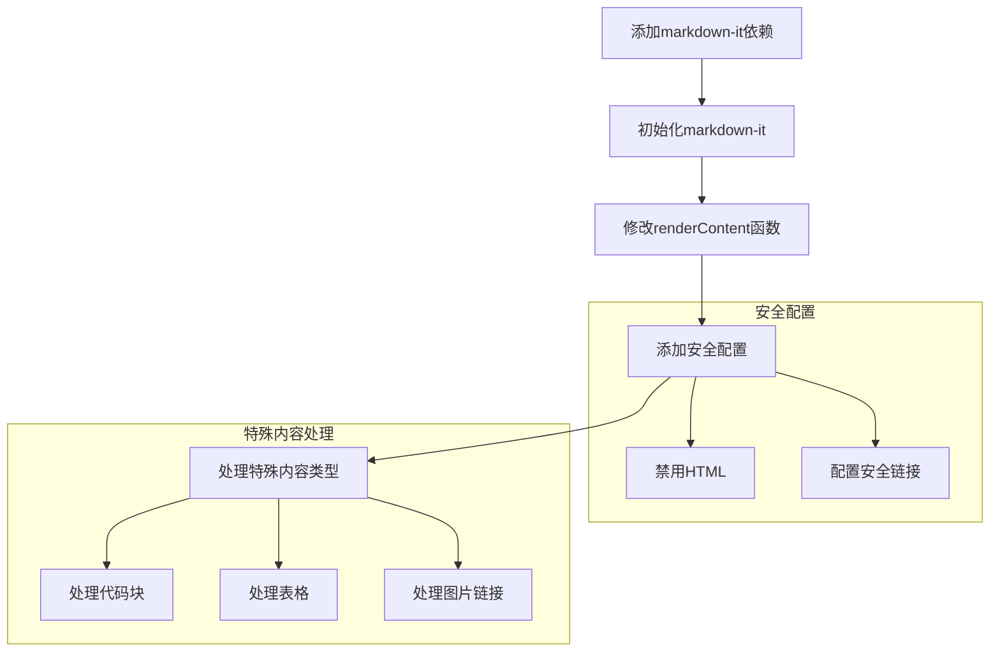

# Chat Markdown渲染实现计划

## 概述
为了提升聊天消息的显示效果，我们将在ChatMessages组件中集成markdown-it来支持Markdown格式的渲染。

## 实现流程



## 具体步骤

### 1. 依赖安装
需要添加以下npm包：
```bash
npm install markdown-it
```

### 2. 代码修改
#### 2.1 初始化markdown-it
- 在组件顶部创建markdown-it实例
- 配置安全选项，禁用可能导致XSS的功能

#### 2.2 修改renderContent函数
- 添加Markdown渲染支持
- 保持现有的多媒体内容处理逻辑
- 确保部分响应（流式输出）的正确显示

#### 2.3 样式调整
- 添加markdown内容的基本样式
- 确保与现有的Tailwind样式兼容

## 安全考虑
1. 禁用HTML渲染防止XSS攻击
2. 配置安全的链接处理
3. 确保图片链接的安全性

## 测试计划
1. 测试基本Markdown语法渲染
2. 测试特殊内容类型（图片、音频、视频）的显示
3. 测试流式响应的显示效果
4. 测试长文本和复杂格式的性能