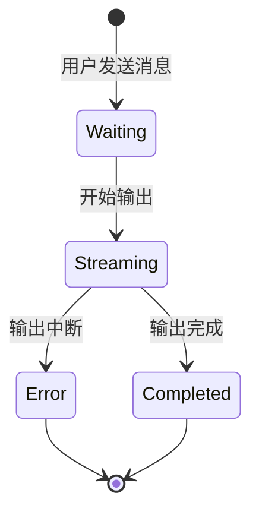

# AI助手回复消息状态管理实施计划

## 1. 状态定义

我们需要为AI助手的回复定义以下4种状态：



各状态说明：
- **Waiting**: 等待AI响应状态
  - 显示动态loading图标(使用react-icons)
  - 显示"正在思考中..."文本
- **Streaming**: 正在输出内容状态
  - 实时显示内容
  - 在内容后显示光标动画
- **Completed**: 输出完成状态
  - 显示完整内容
  - 移除光标动画
- **Error**: 错误状态
  - 显示已输出的内容
  - 在内容后显示错误图标
  - 使用Toast显示错误信息

## 2. 组件改造计划

### 2.1 添加状态枚举
```javascript
const MessageStatus = {
  WAITING: 'waiting',
  STREAMING: 'streaming',
  COMPLETED: 'completed',
  ERROR: 'error'
};
```

### 2.2 修改ChatMessages组件
1. 添加状态相关props：
```javascript
function ChatMessages({ 
  messages, 
  partialResponse, 
  error,
  messageStatus, // 新增状态prop
}) 
```

2. 改造getMessageIcon函数，支持所有状态的图标显示：
```javascript
const getMessageIcon = (role, model, status) => {
  // 现有的user图标逻辑保持不变
  // 根据status显示不同状态的图标
}
```

3. 修改渲染逻辑：
```javascript
const renderMessage = (message, status) => {
  // 根据不同状态渲染不同的UI
}
```

### 2.3 集成Toast错误提示
在Error状态下，使用Toast显示错误信息：
```javascript
useEffect(() => {
  if (messageStatus === MessageStatus.ERROR && error) {
    ToastManager.error(error);
  }
}, [messageStatus, error]);
```

## 3. 修改计划要点

1. 使用react-icons替换现有的Font Awesome图标
2. 保持现有的流式输出逻辑不变
3. 保持现有的UI样式和布局不变
4. 确保错误状态下的Toast提示不会重复触发

## 4. 测试计划

1. 正常对话流程测试
   - 检查Waiting状态的loading动画
   - 验证Streaming状态的实时输出
   - 确认Completed状态的完整显示

2. 错误处理测试
   - 测试网络中断场景
   - 验证错误图标显示
   - 检查Toast错误提示

3. 性能测试
   - 验证状态切换的流畅性
   - 确保不影响现有的滚动和动画效果

## 5. 实施步骤

1. 创建新分支进行开发
2. 更新依赖，添加必要的图标组件
3. 实现状态管理逻辑
4. 更新UI组件
5. 进行测试
6. 代码审查
7. 合并到主分支

## 6. 注意事项

1. 保持现有功能的完整性
2. 确保状态转换的平滑性
3. 维持代码的可维护性
4. 注意错误处理的完备性