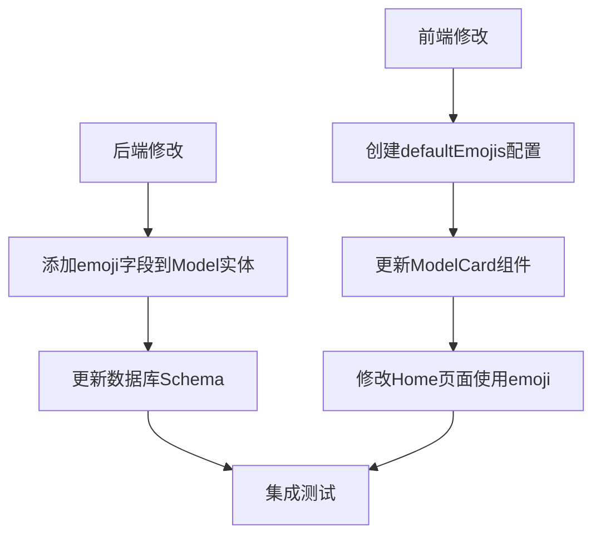

# 模型卡片Emoji图标实现方案

## 当前状况
- 前端使用hardcoded的iconMap来映射模型名称到图标组件
- 后端Model实体类中没有emoji相关字段

## 实现计划

### 1. 后端修改
- Model实体类添加emoji字段：
  ```java
  @Column
  private String emoji;
  ```
- 数据库修改：
  - 添加emoji列，允许为null
  - 默认值为null，表示使用前端默认emoji

### 2. 前端修改
- 移除当前的iconMap硬编码
- 创建默认emoji配置文件 `frontend/src/config/defaultEmojis.js`：
  ```js
  export const defaultModelEmojis = {
    'GPT-4': '🤖',
    'Claude': '🧠',
    'Gemini': '💫',
    'Llama 2': '🦙',
    'default': '🤖'  // 当后端未提供emoji时的默认值
  };
  ```
- 修改ModelCard组件：
  - 移除iconComponent和iconBgColor属性
  - 添加emoji属性
  - 更新样式以适配emoji显示

### 3. 具体实现步骤



### 4. 技术细节
1. ModelCard组件更新：
   - 移除react-icons依赖
   - 添加emoji显示样式
   - 处理emoji回退逻辑

2. Home页面更新：
   - 导入defaultModelEmojis
   - 在模型数据处理时添加emoji处理逻辑
   
3. 样式优化：
   - 调整emoji大小和对齐方式
   - 确保在不同平台上emoji显示一致

### 5. 回退策略
如果后端返回的model数据中emoji为null或undefined：
1. 首先查找defaultModelEmojis中是否有该模型的默认emoji
2. 如果没有找到，使用defaultModelEmojis.default作为默认值

### 6. 测试计划
1. 后端API测试：
   - 测试带emoji和不带emoji的数据返回
   - 验证数据库字段正确性

2. 前端组件测试：
   - 测试emoji显示
   - 测试默认值回退逻辑
   - 测试不同平台上的显示效果

3. 集成测试：
   - 验证完整流程
   - 确认样式和交互正确性