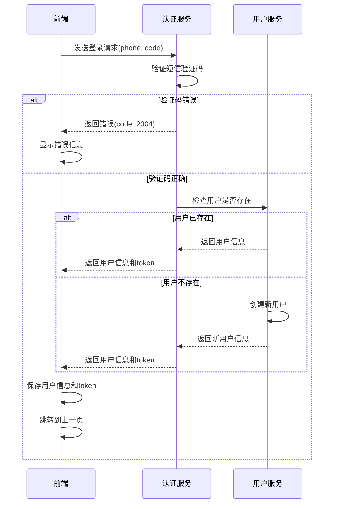

# 登录逻辑修复计划

## 当前问题
1. 短信验证码错误时，虽然显示了错误信息，但是登录逻辑继续执行了
2. 没有检查用户是否已注册，需要实现"未注册则注册，已注册则直接登录"的逻辑

## 系统流程图



## 具体实现步骤

### 1. 前端修改 (LoginForm.js)
```javascript
const handleSubmit = async (e) => {
  e.preventDefault();
  if (!phone || !code) {
    setError('请填写完整信息');
    return;
  }

  try {
    setError('');
    // 调用登录接口
    const response = await authApi.loginWithPhone({
      phone,
      code
    });
    
    // 验证码错误，直接返回
    if (response.code === 2004) {
      setError('短信验证码错误，请重新输入');
      return;
    }
    
    // 登录成功
    login(response.data);
    navigate(-1);
  } catch (error) {
    setError(error.message);
  }
};
```

### 2. 后端修改
在用户服务中添加相关方法：
```java
public ApiResponse login(String phone, String code) {
    // 1. 验证短信验证码
    if (!verifyCode(phone, code)) {
        return ApiResponse.error(ErrorCode.SMS_CODE_INVALID);
    }
    
    // 2. 查询用户是否存在
    User user = userService.findByPhone(phone);
    
    // 3. 用户不存在则注册
    if (user == null) {
        user = userService.register(phone);
    }
    
    // 4. 生成token并返回用户信息
    String token = generateToken(user);
    UserDTO userDTO = convertToDTO(user);
    userDTO.setToken(token);
    
    return ApiResponse.success(userDTO);
}
```

## 预期结果

### 1. 当验证码错误时：
- 前端显示"短信验证码错误，请重新输入"
- 用户停留在登录页面
- 清空验证码输入框

### 2. 当验证码正确时：
- 如果是新用户，自动注册并登录
- 如果是老用户，直接登录
- 返回用户信息和token
- 跳转到上一页

## 下一步
切换到代码模式开始实现此修复方案。重点关注：
1. 前端错误处理逻辑的完善
2. 后端用户服务的实现
3. 确保验证码验证与用户注册/登录的流程顺畅衔接