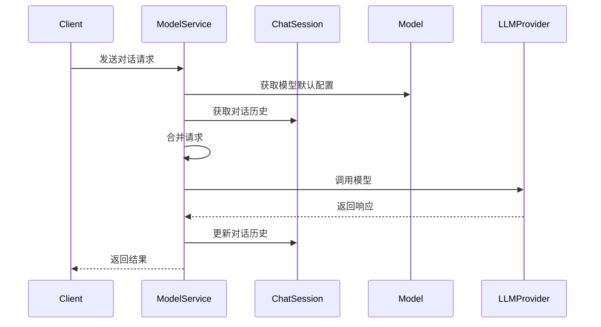

# 模型调用流程设计（简化版）

## 核心思路
1. 直接使用JSON对象处理数据，减少DTO转换
2. 复用已有的JSON结构，减少数据转换
3. 统一消息格式，方便处理

## 数据流程图



## 简化的数据结构

1. 统一的消息格式
```json
{
    "role": "user",
    "content": [
        {
            "text": "消息内容",
            "type": "text"
        }
    ]
}
```

2. 模型配置（Model.invokeConfig）
```json
{
    "model": "qwen-plus",
    "system_message": {
        "role": "system",
        "content": [
            {
                "text": "You are a helpful assistant.",
                "type": "text"
            }
        ]
    },
    // 基础参数，均为可选
    "stream": true,
    "temperature": 0.7,
    "max_tokens": 2000,
    
    // 扩展参数，均为可选
    "top_p": 0.9,               // 控制采样概率阈值
    "presence_penalty": 0.0,    // 控制重复使用已出现token的倾向
    "frequency_penalty": 0.0,   // 控制重复使用高频token的倾向
    "stop": ["##"],            // 指定停止生成的终止序列
    "top_k": 50,               // 限制每一步采样时考虑的token数量
    "repetition_penalty": 1.1   // 重复惩罚因子
}
```

3. 会话历史（ChatSession.messages，直接存储消息数组）
```json
[
    {
        "role": "user",
        "content": [
            {
                "text": "你好",
                "type": "text"
            }
        ]
    },
    {
        "role": "assistant",
        "content": [
            {
                "text": "你好！有什么我可以帮你的吗？",
                "type": "text"
            }
        ]
    }
]
```

## 简化的处理流程

```java
public class ModelService {
    
    public String chat(String modelId, String sessionId, String userInput) {
        // 1. 获取模型配置
        Model model = modelRepository.findById(modelId);
        JsonNode modelConfig = objectMapper.readTree(model.getInvokeConfig());
        
        // 2. 获取会话历史
        ChatSession session = chatSessionRepository.findById(sessionId);
        JsonNode historyMessages = objectMapper.readTree(session.getMessages());
        
        // 3. 构造请求体
        ObjectNode requestBody = objectMapper.createObjectNode();
        // 3.1 设置必需参数
        requestBody.put("model", modelConfig.get("model").asText());
        
        // 3.2 设置可选参数
        List<String> optionalParams = Arrays.asList(
            "stream", "temperature", "max_tokens", "top_p", 
            "presence_penalty", "frequency_penalty", "stop",
            "top_k", "repetition_penalty"
        );
        
        for (String param : optionalParams) {
            if (modelConfig.has(param)) {
                JsonNode value = modelConfig.get(param);
                if (value.isBoolean()) {
                    requestBody.put(param, value.asBoolean());
                } else if (value.isNumber()) {
                    requestBody.put(param, value.asDouble());
                } else if (value.isArray()) {
                    requestBody.set(param, value);
                } else {
                    requestBody.put(param, value.asText());
                }
            }
        }
        
        // 4. 组装消息
        ArrayNode messages = objectMapper.createArrayNode();
        // 4.1 添加系统消息
        messages.add(modelConfig.get("system_message"));
        // 4.2 添加历史消息
        messages.addAll((ArrayNode) historyMessages);
        // 4.3 添加新消息
        ObjectNode newMessage = objectMapper.createObjectNode();
        newMessage.put("role", "user");
        ArrayNode content = objectMapper.createArrayNode();
        ObjectNode textContent = objectMapper.createObjectNode();
        textContent.put("text", userInput);
        textContent.put("type", "text");
        content.add(textContent);
        newMessage.set("content", content);
        messages.add(newMessage);
        
        requestBody.set("messages", messages);
        
        // 5. 调用模型
        String response = callModelApi(requestBody.toString());
        
        // 6. 更新会话历史
        messages.add(objectMapper.readTree(response));
        session.setMessages(messages.toString());
        chatSessionRepository.save(session);
        
        return response;
    }
}
```

## 简化方案的优点

1. 直接操作JSON数据：
   - 不需要定义多个DTO类
   - 减少对象转换的开销
   - 更灵活地处理数据结构

2. 统一的消息格式：
   - 所有消息使用相同的结构
   - 易于验证和处理
   - 直接存储和读取

3. 更少的代码量：
   - 不需要维护多个DTO类
   - 减少了类型转换代码
   - 逻辑更直观

4. 更好的可维护性：
   - 数据结构简单明确
   - 处理逻辑集中
   - 易于调试和修改

5. 灵活的参数配置：
   - 支持多种类型的参数
   - 易于添加新参数
   - 根据不同模型动态调整

## 注意事项

1. JSON处理：
   - 使用Jackson的JsonNode处理JSON
   - 处理可能的JSON解析异常
   - 注意JSON字段的类型转换

2. 数据验证：
   - 验证必要的字段存在
   - 检查数据格式的正确性
   - 处理异常情况

3. 性能考虑：
   - 合理使用JsonNode的API
   - 避免不必要的JSON解析
   - 考虑大量数据时的处理

4. 参数使用：
   - 了解不同参数的作用和影响
   - 根据场景选择合适的参数
   - 注意参数之间的相互影响