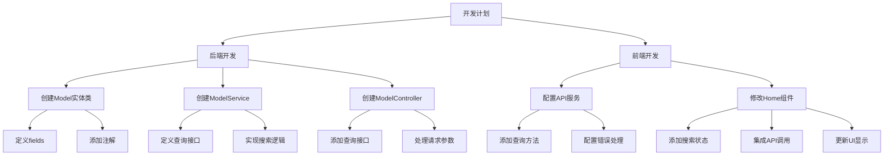

# AI模型查询接口开发计划

## 1. 功能概述

开发模型查询接口，支持按名称(name)和用途(purpose)搜索AI模型。

### 接口信息
- 地址：`/api/model/query`
- 请求方法：GET
- 输入参数：
  - name（可选）：模型名称
  - purpose（可选）：模型用途
- 输出：匹配的模型列表或全部数据

## 2. 技术方案

### 2.1 后端开发

#### a. Model实体类
创建对应数据库表的实体类，包含以下字段：
- id: Integer (主键)
- name: String (模型名称)
- baseUrl: String (基础URL)
- apiKey: String (API密钥)
- rating: BigDecimal (评分)
- description: Text (描述)
- purpose: String (用途)
- provider: String (提供商)
- isOpenSource: Boolean (是否开源)
- invocationMethod: String (调用方式)

#### b. Service层
实现模型查询服务：
- 创建ModelService接口
- 实现ModelServiceImpl类
- 实现查询逻辑，支持name和purpose条件筛选

#### c. Controller层
实现REST API接口：
- 创建ModelController类
- 实现查询接口，处理请求参数
- 返回查询结果

### 2.2 前端开发

#### a. API服务配置
在api.js中添加模型查询方法：
- 配置查询接口
- 处理请求参数
- 实现错误处理

#### b. 页面集成
更新Home.js组件：
- 添加数据加载逻辑
- 实现搜索功能
- 更新UI显示

## 3. 实现步骤

## 4. 预期效果

1. 后端API能够根据name和purpose参数查询模型数据
2. 前端页面加载时自动获取所有模型数据
3. 支持按名称和用途搜索模型
4. 搜索结果实时更新到页面上