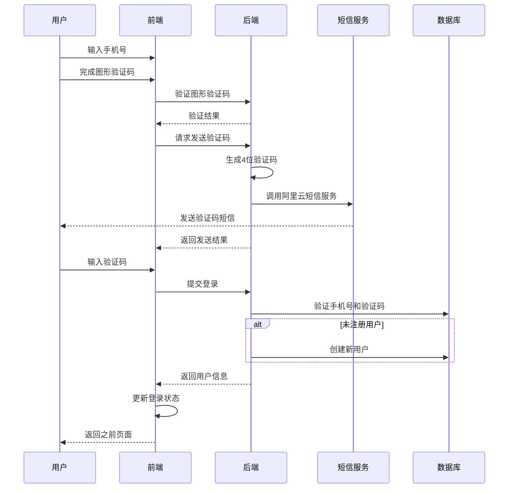

# 手机验证码登录功能实现方案

## 1. 系统架构



## 2. 数据库设计

### User表扩展
```sql
ALTER TABLE user ADD COLUMN phone VARCHAR(11) UNIQUE;
```

### VerificationCode表（新增）
```sql
CREATE TABLE verification_code (
    id BIGINT PRIMARY KEY AUTO_INCREMENT,
    phone VARCHAR(11) NOT NULL,
    code VARCHAR(4) NOT NULL,
    created_at TIMESTAMP DEFAULT CURRENT_TIMESTAMP,
    expired_at TIMESTAMP,
    status TINYINT DEFAULT 0, -- 0:未使用 1:已使用
    INDEX idx_phone (phone),
    INDEX idx_code_status (code, status)
);
```

### CaptchaRecord表（新增）
```sql
CREATE TABLE captcha_record (
    id BIGINT PRIMARY KEY AUTO_INCREMENT,
    captcha_id VARCHAR(32) NOT NULL,
    captcha_code VARCHAR(6) NOT NULL,
    ip_address VARCHAR(45) NOT NULL,
    created_at TIMESTAMP DEFAULT CURRENT_TIMESTAMP,
    expired_at TIMESTAMP,
    status TINYINT DEFAULT 0, -- 0:未使用 1:已使用
    INDEX idx_captcha_id (captcha_id),
    INDEX idx_ip_status (ip_address, status)
);
```

## 3. 后端实现

### 3.1 图形验证码服务（新增）
- 路径：`backend/src/main/java/com/aibuffet/service/CaptchaService.java`
- 功能：
  - 生成图形验证码
  - 验证码存储与验证
  - IP限流控制

### 3.2 验证码服务（新增）
- 路径：`backend/src/main/java/com/aibuffet/service/VerificationCodeService.java`
- 功能：
  - 生成随机验证码
  - 调用阿里云发送短信
  - 验证码有效性校验（5分钟有效期）
  - 验证码状态管理

### 3.3 用户服务扩展
- 路径：`backend/src/main/java/com/aibuffet/service/UserService.java`
- 新增功能：
  - 手机号查询用户
  - 手机号注册用户
  - 验证码登录

### 3.4 API接口

#### 获取图形验证码
```
GET /api/auth/captcha/generate
Response:
{
    "code": 200,
    "data": {
        "captchaId": "唯一标识",
        "captchaImage": "Base64图片"
    }
}
```

#### 发送短信验证码
```
POST /api/auth/code/send
Request:
{
    "phone": "手机号",
    "captchaId": "图形验证码ID",
    "captchaCode": "图形验证码"
}
Response:
{
    "code": 200,
    "message": "发送成功"
}
```

#### 验证码登录/注册
```
POST /api/auth/login/phone
Request:
{
    "phone": "手机号",
    "code": "验证码"
}
Response:
{
    "code": 200,
    "data": {
        "id": "用户ID",
        "username": "用户名",
        "avatar": "头像URL",
        "phone": "手机号"
    }
}
```

## 4. 前端实现

### 4.1 API服务（新增）
- 路径：`frontend/src/services/auth.js`
- 功能：
  - 获取图形验证码
  - 发送验证码请求
  - 验证码登录请求

### 4.2 图形验证码组件（新增）
- 路径：`frontend/src/components/auth/CaptchaInput.js`
- 功能：
  - 显示图形验证码
  - 刷新验证码
  - 验证码输入

### 4.3 登录表单组件优化
- 路径：`frontend/src/components/auth/LoginForm.js`
- 优化点：
  - 添加图形验证码组件
  - 集成验证码发送API
  - 集成登录API
  - 完善错误处理
  - 优化用户提示

### 4.4 状态管理优化
- 路径：`frontend/src/contexts/AuthContext.js`
- 优化点：
  - 完善用户信息存储
  - 添加登录状态持久化
  - 添加自动登录功能

## 5. 开发步骤

1. 后端开发
   - 实现图形验证码服务
   - 配置阿里云短信服务
   - 实现验证码服务
   - 实现用户服务扩展
   - 实现API接口
   - 编写单元测试

2. 前端开发
   - 实现API服务
   - 开发图形验证码组件
   - 优化登录表单
   - 完善状态管理
   - 添加错误处理
   - 优化用户体验

## 6. 安全考虑

1. 图形验证码安全
   - 验证码复杂度要求
   - 验证码有效期2分钟
   - IP级别限流（每IP每分钟最多请求5次）

2. 短信验证码安全
   - 必须先通过图形验证码才能发送
   - 60秒内限制发送次数
   - 验证码5分钟有效期
   - 验证码一次性使用
   - IP级别限流

3. 接口安全
   - 添加请求频率限制
   - 验证手机号格式
   - 防重放攻击
   - 日志记录

## 7. 测试计划

1. 单元测试
   - 图形验证码生成测试
   - 验证码生成测试
   - 短信发送测试
   - 用户注册测试
   - 登录验证测试

2. 集成测试
   - API接口测试
   - 数据库操作测试
   - 短信服务集成测试
   - 限流功能测试

3. 前端测试
   - 图形验证码组件测试
   - 登录表单组件测试
   - 用户交互测试
   - 错误处理测试
   - 状态管理测试

## 8. 错误处理

### 前端错误提示
1. 图形验证码相关
   - "图形验证码已失效，请重新获取"
   - "图形验证码错误，请重新输入"
   - "请求图形验证码过于频繁，请稍后再试"

2. 短信验证码相关
   - "请先完成图形验证码验证"
   - "短信验证码发送失败，请重试"
   - "发送过于频繁，请60秒后重试"

3. 登录相关
   - "验证码已过期，请重新获取"
   - "手机号或验证码错误"
   - "登录失败，请重试"

### 后端错误码
```java
public enum ErrorCode {
    CAPTCHA_EXPIRED(1001, "图形验证码已过期"),
    CAPTCHA_INVALID(1002, "图形验证码错误"),
    CAPTCHA_RATE_LIMIT(1003, "图形验证码获取过于频繁"),
    
    SMS_CAPTCHA_REQUIRED(2001, "请先完成图形验证码验证"),
    SMS_SEND_FAILED(2002, "短信发送失败"),
    SMS_RATE_LIMIT(2003, "短信发送过于频繁"),
    
    LOGIN_INVALID_CODE(3001, "验证码错误或已过期"),
    LOGIN_FAILED(3002, "登录失败"),
    REGISTER_FAILED(3003, "注册失败")
}