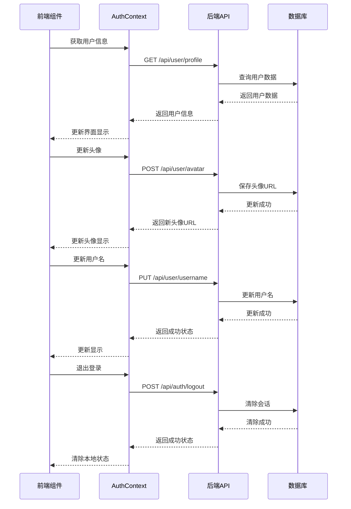

# 用户信息更新功能实现计划

## 1. 系统架构



## 2. 后端API设计

### 2.1 用户信息查询
```
GET /api/user/profile
Authorization: Bearer {token}

Response:
{
    "code": 0,
    "data": {
        "id": "string",
        "username": "string",
        "phone": "string",
        "email": "string",
        "avatar": "string",
        "wechat": "string",
        "createTime": "timestamp"
    }
}
```

### 2.2 更新头像
```
POST /api/user/avatar
Authorization: Bearer {token}
Content-Type: multipart/form-data

Body:
- file: (binary)

Response:
{
    "code": 0,
    "data": {
        "avatarUrl": "string"
    }
}
```

### 2.3 更新用户名
```
PUT /api/user/username
Authorization: Bearer {token}
Content-Type: application/json

Body:
{
    "username": "string"
}

Response:
{
    "code": 0,
    "data": {
        "username": "string"
    }
}
```

### 2.4 退出登录
```
POST /api/auth/logout
Authorization: Bearer {token}

Response:
{
    "code": 0,
    "message": "退出成功"
}
```

## 3. 后端实现计划

### 3.1 实体类更新
- 在User实体中添加新字段：
  - lastLoginTime: 最后登录时间（其他字段如avatar、updatedAt已存在）

### 3.2 数据库表更新
```sql
ALTER TABLE user
ADD COLUMN last_login_time TIMESTAMP;
```

### 3.3 需要创建的类
1. Controller层
```java
@RestController
@RequestMapping("/api/user")
public class UserController {
    // 获取用户信息
    @GetMapping("/profile")
    
    // 更新头像
    @PostMapping("/avatar")
    
    // 更新用户名
    @PutMapping("/username")
}

@RestController
@RequestMapping("/api/auth")
public class AuthController {
    // 退出登录
    @PostMapping("/logout")
}
```

2. Service层
```java
public interface UserService {
    UserProfile getUserProfile(String userId);
    String updateAvatar(String userId, MultipartFile file);
    String updateUsername(String userId, String username);
    void logout(String userId);
}
```

3. Repository层
```java
public interface UserRepository extends JpaRepository<User, String> {
    Optional<User> findByIdAndDeletedFalse(String id);
}
```

## 4. 前端实现计划

### 4.1 AuthContext 更新
```javascript
// 添加新的方法
const updateAvatar = async (file) => {
    const formData = new FormData();
    formData.append('file', file);
    const response = await api.post('/api/user/avatar', formData);
    setUser(prev => ({...prev, avatar: response.data.avatarUrl}));
};

const updateUsername = async (username) => {
    const response = await api.put('/api/user/username', { username });
    setUser(prev => ({...prev, username: response.data.username}));
};

const logout = async () => {
    await api.post('/api/auth/logout');
    setUser(null);
    // 清除token等信息
};
```

### 4.2 UserProfile组件更新
- 添加加载状态处理
- 添加错误处理
- 优化文件上传限制
- 添加头像裁剪功能
- 添加用户名验证

## 5. 文件存储方案
1. 使用阿里云OSS存储用户上传的头像
   - 需要的配置信息：
     ```properties
     # 敏感信息通过环境变量注入
     aliyun.oss.access-key-id=${ALIBABA_CLOUD_ACCESS_KEY_ID}
     aliyun.oss.access-key-secret=${ALIBABA_CLOUD_ACCESS_KEY_SECRET}
     aliyun.oss.bucket-name=aibuffet
     aliyun.oss.endpoint=oss-cn-chengdu-internal.aliyuncs.com
     ```
   - OSS Bucket配置：
     - Bucket: aibuffet（专门用于存储用户头像）
     - 访问权限：私有读写，通过签名URL访问
     - CORS配置：
       ```json
       {
         "CORSRules": [{
           "AllowedOrigins": ["http://localhost:3000"],
           "AllowedMethods": ["GET", "POST", "PUT"],
           "AllowedHeaders": ["*"],
           "ExposeHeaders": ["ETag"],
           "MaxAgeSeconds": 3600
         }]
       }
       ```
     - 防盗链配置：
       - Referer白名单：["http://localhost:3000"]
       - 不允许空Referer
     - 生命周期规则：
       - 删除未引用的文件（例如：7天后删除临时文件）

2. 实现文件上传服务
   - 后端服务配置：
     ```java
     @Configuration
     public class OSSConfig {
         @Value("${aliyun.oss.access-key-id}")
         private String accessKeyId;
         
         @Value("${aliyun.oss.access-key-secret}")
         private String accessKeySecret;
         
         @Value("${aliyun.oss.bucket-name}")
         private String bucketName;
         
         @Value("${aliyun.oss.endpoint}")
         private String endpoint;
         
         // OSS客户端配置
     }
     ```
   - 文件命名规则：`avatars/${userId}/${timestamp}_${filename}`
   - 生成签名访问URL，有效期24小时

3. 安全配置
   - 配置CORS，只允许特定域名访问
   - 配置防盗链，限制请求来源
   - 定期清理未引用的文件

## 6. 安全性考虑
1. 文件上传安全
   - 文件类型验证
   - 文件大小限制
   - 文件名安全处理
   - 防止重复上传
2. 接口安全
   - Token验证
   - 请求频率限制
   - CSRF防护
3. 数据安全
   - 敏感信息加密
   - XSS防护
   - SQL注入防护

## 7. 测试计划
1. 单元测试
   - Controller层测试
   - Service层测试
   - 文件上传服务测试
2. 集成测试
   - API端点测试
   - 文件存储测试
3. 前端测试
   - 组件渲染测试
   - 用户交互测试
   - 错误处理测试

## 8. 部署计划
1. 数据库迁移
2. OSS配置
3. 后端服务部署
4. 前端构建和部署
5. 监控告警配置

## 9. 后续优化
1. 图片压缩和优化
2. 用户信息缓存
3. 批量处理能力
4. 性能监控
5. 用户行为分析